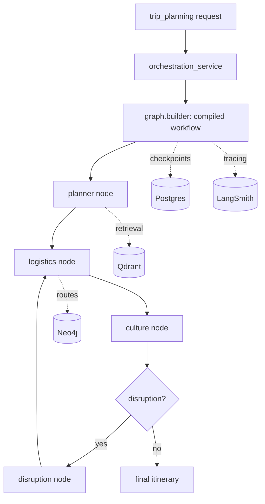

# AI Service

The AI Service is the intelligence layer of the travel platform. It orchestrates agent workflows with **LangGraph**, traces and debugs runs with **LangSmith**, retrieves semantic context from **Qdrant**, and traverses route/graph relationships in **Neo4j**, while persisting run metadata in **PostgreSQL** and using **Redis** for queues and caching.[cite:111][cite:113][cite:69]

## Responsibilities

- Run LangGraph orchestration for trip planning, disruption handling, and conversational assistance.
- Perform vector retrieval over travel content in Qdrant for semantic search and grounding.
- Query Neo4j for route options, connections, and graph traversal.
- Trace every agent run and step in LangSmith for observability and debugging.
- Manage LLM configuration (model, provider, parameters) per environment or tenant.
- Run background workers for embeddings, alert ingestion, and asynchronous planning.

## Service boundaries

The AI Service does **not** own user identity or trip persistence. It reads trip and user context through the API Gateway or service calls, and writes only AI-domain data: `llm_configs`, `agent_runs`, `agent_steps`, and LangGraph checkpoints.[cite:101][cite:102]

| Concern                                       | Owner          |
| --------------------------------------------- | -------------- |
| Identity / JWT issuance                       | Supabase Auth  |
| User profile, support, notifications          | User Service   |
| Trips, itineraries, bookings, alerts          | Trip Service   |
| Orchestration, retrieval, routing, LLM config | **AI Service** |

## Folder structure

```text
ai-service/
├── app/
│   ├── main.py
│   ├── api/
│   │   ├── routes/
│   │   │   ├── ai_chat.py
│   │   │   ├── trip_planning.py
│   │   │   ├── disruptions.py
│   │   │   ├── llm_config.py
│   │   │   └── retrieval.py
│   │   └── deps.py
│   ├── core/
│   │   ├── config.py
│   │   ├── langsmith.py
│   │   └── prompts.py
│   ├── graph/
│   │   ├── state.py
│   │   ├── builder.py
│   │   ├── nodes/
│   │   │   ├── planner.py
│   │   │   ├── logistics.py
│   │   │   ├── disruption.py
│   │   │   └── culture.py
│   │   ├── tools/
│   │   │   ├── qdrant_search.py
│   │   │   ├── neo4j_routes.py
│   │   │   ├── weather_api.py
│   │   │   ├── maps_api.py
│   │   │   ├── transport_api.py
│   │   │   └── tourism_api.py
│   │   └── checkpoints/
│   ├── models/
│   │   ├── llm_config.py
│   │   ├── agent_run.py
│   │   └── agent_step.py
│   ├── schemas/
│   ├── services/
│   │   ├── orchestration_service.py
│   │   ├── retrieval_service.py
│   │   ├── routing_service.py
│   │   └── llm_config_service.py
│   ├── repositories/
│   └── workers/
│       ├── embeddings_worker.py
│       ├── alerts_worker.py
│       └── planner_worker.py
├── tests/
└── Dockerfile
```

## Module notes

### API routes (`app/api/routes/`)

- `ai_chat.py`: conversational assistant endpoint; streams or returns agent responses.
- `trip_planning.py`: kicks off a LangGraph planning run for a trip and returns the proposed itinerary.
- `disruptions.py`: accepts disruption/alert events and triggers replanning.
- `llm_config.py`: read/update LLM provider and model parameters.
- `retrieval.py`: direct semantic search endpoint over Qdrant for debugging and tooling.

Keep routes thin: validate input, call a service, return a schema. Business logic lives in `services/`.

### Core (`app/core/`)

- `config.py`: typed settings loaded from environment (model keys, DB hosts, LangSmith).
- `langsmith.py`: LangSmith client/tracing setup and run-tagging helpers.
- `prompts.py`: prompt templates and system prompts, versioned for reproducibility.

### Graph (`app/graph/`)

- `builder.py`: build and compile the LangGraph workflow, wiring nodes, edges, and checkpoints.
- `state.py`: shared typed state object passed between nodes.
- `nodes/`: one file per agent node (`planner`, `logistics`, `disruption`, `culture`).
- `tools/`: integrations for retrieval (`qdrant_search`, `neo4j_routes`) and external APIs (`weather`, `maps`, `transport`, `tourism`).
- `checkpoints/`: LangGraph checkpoint persistence so long-running or interrupted runs can resume.

### Models (`app/models/`)

- `llm_config.py`: persisted LLM configuration records.
- `agent_run.py`: one row per orchestration run (status, trip reference, timing).
- `agent_step.py`: per-node step records linked to a run for auditing and replay.

### Services (`app/services/`)

- `orchestration_service.py`: entry point that invokes the compiled graph and records the run.
- `retrieval_service.py`: Qdrant query construction, embedding, and result ranking.
- `routing_service.py`: Neo4j route queries and graph traversal logic.
- `llm_config_service.py`: read/update LLM configuration with validation.

### Workers (`app/workers/`)

- `embeddings_worker.py`: background indexing of travel content into Qdrant.
- `alerts_worker.py`: ingest or scrape alerts and enqueue replanning jobs.
- `planner_worker.py`: run heavy planning jobs asynchronously off the request path.

## LangGraph flow



## Data ownership

| Store                    | Used for                                                          |
| ------------------------ | ----------------------------------------------------------------- |
| PostgreSQL (`ai_domain`) | `llm_configs`, `agent_runs`, `agent_steps`, LangGraph checkpoints |
| Qdrant                   | `travel_items` collection for semantic retrieval                  |
| Neo4j                    | route/connection graph traversal                                  |
| Redis                    | `queue:embeddings`, `queue:alerts`, planning locks, cache         |

Relevant Redis keys for this service:

```text
queue:embeddings
queue:alerts
lock:trip-plan:{trip_id}
lock:alert-process:{alert_id}
cache:trip:{trip_id}:summary
```

## Environment variables

```env
APP_ENV=development

POSTGRES_HOST=postgres
POSTGRES_PORT=5432
POSTGRES_DB=travel_platform
POSTGRES_USER=postgres
POSTGRES_PASSWORD=postgres

REDIS_HOST=redis
REDIS_PORT=6379

QDRANT_HOST=qdrant
QDRANT_PORT=6333
QDRANT_COLLECTION_TRAVEL=travel_items

NEO4J_URI=bolt://neo4j:7687
NEO4J_USER=neo4j
NEO4J_PASSWORD=neo4jpassword

LANGSMITH_API_KEY=
LANGSMITH_PROJECT=travel-platform
LANGCHAIN_TRACING_V2=true

OPENAI_API_KEY=
MAPS_API_KEY=
WEATHER_API_KEY=
TRANSPORT_API_KEY=
TOURISM_API_KEY=
```

## API surface (draft)

The chat endpoint is the single entry point. A trip idea in a message triggers
planning; follow-up messages on the same `conversation_id` modify the existing
itinerary. Retrieval, routing, and disruption handling run **inside** the graph,
so they are not separate endpoints.

| Method | Path                                            | Description                                                                                                                                           |
| ------ | ----------------------------------------------- | ----------------------------------------------------------------------------------------------------------------------------------------------------- |
| POST   | `/ai/chat`                                      | Main entry. Reply to a message; when it contains a trip idea/change, returns an updated itinerary. Carries `conversation_id` (LangGraph `thread_id`). |
| GET    | `/ai/conversations/{conversation_id}`           | Conversation history plus current plan/itinerary state.                                                                                               |
| GET    | `/ai/conversations/{conversation_id}/itinerary` | Latest itinerary (timeline) for the conversation.                                                                                                     |
| GET    | `/ai/runs/{run_id}`                             | Status/result of an individual planning run.                                                                                                          |
| GET    | `/ai/llm-config`                                | Read current LLM configuration.                                                                                                                       |
| PUT    | `/ai/llm-config`                                | Update LLM configuration.                                                                                                                             |

All endpoints sit behind the API Gateway, which forwards a verified Supabase JWT; the AI Service trusts the gateway-validated identity.[cite:168][cite:169]

## Implementation phases

### Phase 1

- Scaffold service, `config.py`, and health endpoint.
- Wire LangSmith tracing.
- Stub `orchestration_service` and a minimal LangGraph workflow.

### Phase 2

- Implement planner, logistics, disruption, and culture nodes.
- Add Qdrant retrieval and Neo4j routing tools.
- Persist `agent_runs` and `agent_steps`.[cite:111][cite:113][cite:69]

### Phase 3

- Background workers for embeddings and alerts.
- Checkpoint-based resume for long runs.
- Hardening, monitoring, and deployment automation.[cite:159][cite:163]

```

```
